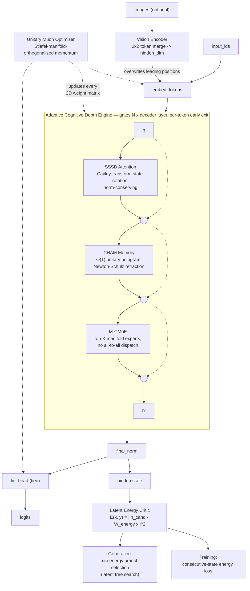

<p align="center">
  
</p>

<p align="center">
  <i>Built top-down from first principles — spectral attention, holographic<br>
  memory, manifold experts, and adaptive per-token compute.</i>
</p>

<p align="center">
  
  
  
  
  <a href="docs/README.md"></a>
  
</p>

<p align="center">
  <a href="https://github.com/Verace-Pvt-Ltd"></a>
  <a href="https://www.linkedin.com/company/verace-ai/"></a>
</p>

<p align="center">
  Created by <a href="mailto:krrish@verace.in">Krrish Choudhary</a>, CEO of Verace Pvt. Ltd.
</p>

<p align="center">
  <a href="#architecture">Architecture</a> ·
  <a href="#status">Status</a> ·
  <a href="#core-components">Components</a> ·
  <a href="#installation">Installation</a> ·
  <a href="#quickstart">Quickstart</a> ·
  <a href="#project-structure">Structure</a> ·
  <a href="#testing">Testing</a> ·
  <a href="#license">License</a>
</p>

<br>

Verace V1 is a next-generation, multimodal (text and vision) large language
model architecture that replaces softmax attention, KV-cache memory, and
discrete routed mixture-of-experts with continuous, manifold-based
alternatives, and adds a mechanism for allocating a different amount of
compute to each token.

<br>

## Architecture



<p align="center"><sub>Full derivations, invariants, and per-module diagrams: <a href="docs/README.md">docs/</a></sub></p>

<br>

## Status

> **Reference implementation, not a trained model.** This repository is the
> architecture: module code, configuration, and a unit/integration test
> suite. **It does not include pretrained weights.** The training script is
> a minimal, correct single-step reference for wiring the model, loss, and
> optimizer together — not a distributed, production-scale pipeline.

See [docs/](docs/README.md) for the full modular documentation — one page
per module, including the exact invariant each one guarantees, which test
verifies it, and what's a genuine implementation vs. a documented extension
point that isn't wired in yet.

<br>

## Core Components

| Component | What it replaces | Mechanism |
| :--- | :--- | :--- |
| **Spectral State-Space Differential Attention (SSSD)** | Softmax self-attention | Norm-conserving recurrent state update via a skew-symmetric Cayley transform |
| **Continuous Holographic Associative Memory (CHAM)** | KV cache | O(1)-per-token unitary holographic matrix, updated via Newton-Schulz retraction |
| **Manifold Continuous MoE (M-CMoE)** | Discrete routed MoE | Per-token low-rank expert weights generated from a shared manifold basis, no all-to-all dispatch |
| **Adaptive Cognitive Depth Engine (ACDE)** | Fixed per-layer compute | Per-token early exit (ACT-style halting), 2–128 layers per token |
| **Latent Energy Critic** | Beam / sampling-only decoding | Scalar energy scoring over parallel latent thought branches |
| **Vision Encoder** | Separate vision-language pipeline | Patch-based ViT with 2×2 token merging, spliced directly into the token sequence |
| **Unitary Muon Optimizer** | AdamW / plain Muon | Stiefel-manifold-orthogonalized momentum updates |

<p align="center"><sub>Full derivations and code references for each are in <a href="docs/README.md">docs/</a></sub></p>

<br>

## Installation

```bash
git clone https://github.com/Verace-Pvt-Ltd/verace-v1.git
cd verace-v1
pip install -e .
```

Requires Python 3.10+ and PyTorch 2.2+. Triton is required only for the GPU
kernel path (`verace_v1/serving/triton_kernels.py`); everything else runs on
CPU via the pure PyTorch fallback path.

<br>

## Quickstart

```python
import torch
from verace_v1 import VeraceV1Config, VeraceV1Model, VeraceV1Generator

config = VeraceV1Config(
    vocab_size=32000,
    hidden_dim=1024,
    num_layers=12,
    num_heads=8,
    head_dim=128,
)

model = VeraceV1Model(config)

input_ids = torch.randint(0, config.vocab_size, (1, 32))
logits, depth_counts = model(input_ids, use_adaptive_depth=True)
print(logits.shape, depth_counts.float().mean())

generator = VeraceV1Generator(model, config)
# Defaults to latent tree search (samples config.tree_branches candidates per
# token, keeps the lowest-energy one) — costs tree_branches+1 forward passes
# per token. Pass use_tree_search=False for plain single-path sampling.
print(generator.generate("Explain the Verace V1 architecture", max_new_tokens=32))
```

For a full walkthrough — model creation, a pretraining step with the Unitary
Muon optimizer, generation, and benchmark evaluation — see
[`tests/test_end2end.py`](tests/test_end2end.py) and
[docs/serving/generation.md](docs/serving/generation.md).

<br>

## Project Structure

<details>
<summary><b>Show full repository layout</b></summary>

```
verace-v1/
├── LICENSE
├── pyproject.toml
├── conftest.py
├── requirements.txt
├── README.md
├── docs/                            # Modular docs, mirroring verace_v1/ 1:1 — see docs/README.md
│   ├── README.md                    # Documentation index
│   ├── getting-started.md
│   ├── configuration.md
│   ├── testing.md
│   ├── modules/                     # One doc per verace_v1/modules/ file
│   ├── optimizer/
│   ├── chat_template/
│   ├── serving/
│   ├── training/
│   └── eval/
├── verace_v1/
│   ├── __init__.py
│   ├── config.py                   # Architecture & hyperparameter specification
│   ├── modules/
│   │   ├── sssd_attention.py       # Spectral State-Space Differential Attention
│   │   ├── cham_memory.py          # Continuous Holographic Associative Memory
│   │   ├── mcmoe.py                # Manifold Continuous Mixture-of-Experts
│   │   ├── acd_engine.py           # Adaptive Cognitive Depth Engine
│   │   ├── energy_critic.py        # Latent energy critic & branch selection
│   │   ├── activations.py          # SiTU-GLU activation
│   │   ├── vision.py               # Patch-based vision encoder
│   │   └── backbone.py             # Decoder layer & full model assembly
│   ├── optimizer/
│   │   └── unitary_muon.py         # Unitary Muon optimizer (Stiefel-manifold orthogonalization)
│   ├── chat_template/
│   │   └── hyper_xtml.py           # Hyper-XTML reasoning-trace template
│   ├── training/
│   │   └── pretrain.py             # Minimal pretraining step reference
│   ├── serving/
│   │   ├── sssd_triton.py          # Triton GPU kernel for SSSD recurrence
│   │   ├── triton_kernels.py       # Triton GPU kernels for CHAM / M-CMoE / Unitary Muon
│   │   └── hyper_generate.py       # Latent tree search generation engine
│   └── eval/
│       └── benchmark_runner.py     # Evaluation harness
└── tests/
    ├── test_sssd.py                # SSSD norm-conservation test
    ├── test_cham.py                # CHAM unitary-constraint test
    ├── test_mcmoe.py                # M-CMoE shape/stability test
    ├── test_acd.py                 # ACDE batch-independence & gathering test
    ├── test_unitary_muon.py        # SVD orthogonalization test (square/tall/wide)
    └── test_end2end.py             # Full pipeline integration test
```

</details>

<br>

## Testing

```bash
python3 -m pytest tests/ -v
```

<br>

## Contributing

This project is not currently open to external contributions. Feel free to
open a GitHub issue for bugs or questions, but pull requests will not be
reviewed at this time.

<br>

## License

Verace V1 is licensed under the [PolyForm Noncommercial License 1.0.0](LICENSE) —
free for research, education, personal projects, and nonprofit/public-sector use.

**Commercial use requires a separate license.** To license Verace V1 for
commercial use, contact **krrish@verace.in**.

<br>

<p align="center">
  <sub>
    <a href="docs/README.md">Docs</a> ·
    <a href="LICENSE">License</a> ·
    <a href="https://github.com/Verace-Pvt-Ltd">GitHub</a> ·
    <a href="https://www.linkedin.com/company/verace-ai/">LinkedIn</a> ·
    <a href="mailto:krrish@verace.in">Contact</a>
  </sub>
</p>

<p align="center"><sub>© 2026 Verace Pvt. Ltd.</sub></p>
