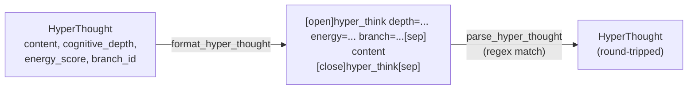

# Hyper-XTML

**Module:** `verace_v1/chat_template/hyper_xtml.py`
**Classes:** `HyperXTMLFormatter`, `HyperThought`

## What It Is

A small, structured text format for serializing one reasoning-trace
"thought" — its content plus the metadata produced alongside it (how many
layers it took to compute, its energy score, which latent branch it came
from). It exists to give generated reasoning traces a consistent,
round-trippable wire format rather than free-form text.

## Format

```
[open]hyper_think depth="<cognitive_depth>" energy="<energy_score>" branch="<branch_id>"[sep]
<content>
[close]hyper_think[sep]
```

- `depth`: the `depth_counts` value associated with this thought (see
  [../modules/acd-engine.md](../modules/acd-engine.md))
- `energy`: the value from `LatentEnergyCritic.compute_energy` for this
  thought, formatted to 4 decimal places (see
  [../modules/energy-critic.md](../modules/energy-critic.md))
- `branch`: which latent rollout branch produced this thought

## `HyperThought`

```python
@dataclass
class HyperThought:
    content: str
    cognitive_depth: int
    energy_score: float
    branch_id: int = 0
```

## `HyperXTMLFormatter`

```python
format_hyper_thought(thought: HyperThought) -> str
parse_hyper_thought(text: str) -> Optional[HyperThought]
```

`format_hyper_thought` produces the wire format above from a `HyperThought`;
`parse_hyper_thought` extracts a `HyperThought` back out of text containing
that format (via a single non-greedy regex match), returning `None` if the
pattern isn't found. The two are inverses of each other for well-formed
input.

## Current Integration Status

`HyperXTMLFormatter` is instantiated by `VeraceV1Generator`
(`self.formatter`, see [../serving/generation.md](../serving/generation.md))
but the current `generate()` loop returns raw decoded text rather than
formatting it through `HyperXTMLFormatter` — wiring generation output through
the formatter (and constructing `HyperThought` instances from `depth_counts`
/ energy scores, which `generate()` now computes per step via tree search —
see [../serving/generation.md](../serving/generation.md)) is a natural
extension point, not yet implemented.

## Diagram


