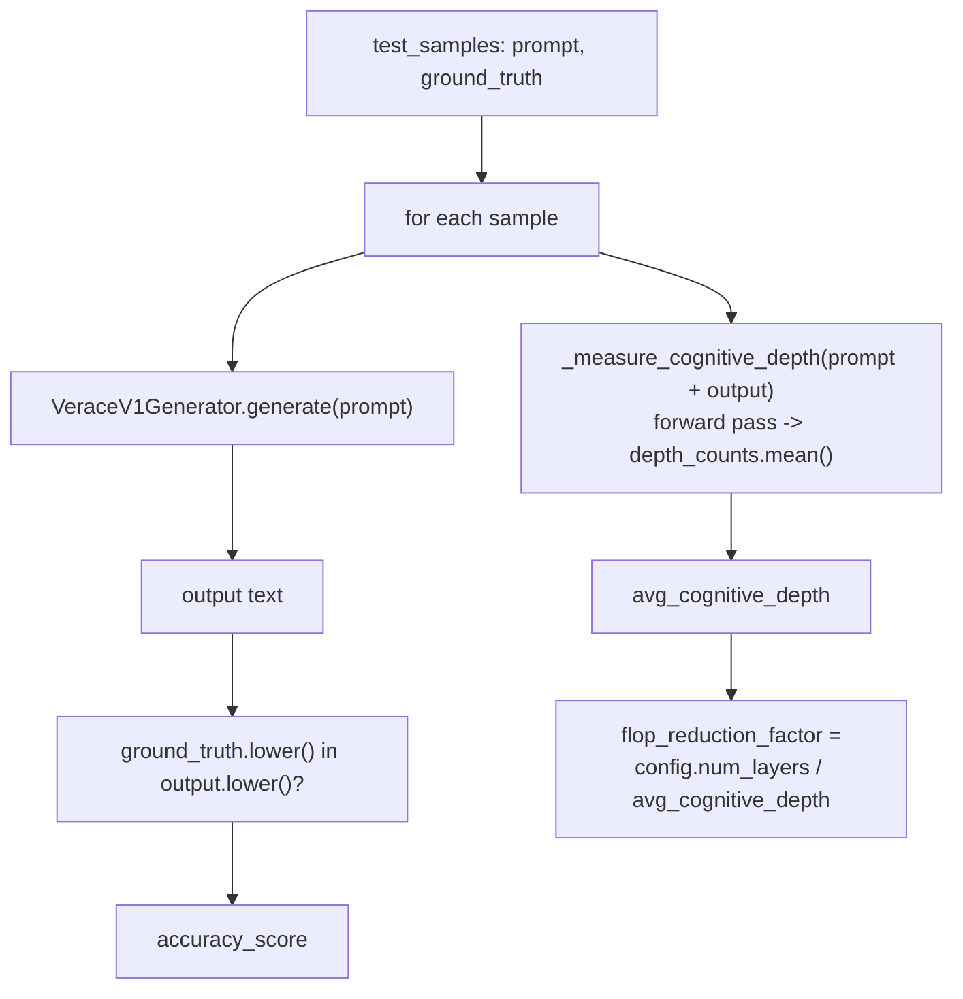

# Benchmark Runner

**Module:** `verace_v1/eval/benchmark_runner.py`
**Class:** `VeraceV1Evaluator`
**Test:** exercised in `tests/test_end2end.py`

## What It Does

```python
VeraceV1Evaluator(model: VeraceV1Model, config: VeraceV1Config)

evaluate_benchmark(
    benchmark_name: str,
    test_samples: Optional[List[Dict[str, str]]] = None,
) -> Dict[str, Any]
```

For each `{"prompt": ..., "ground_truth": ...}` sample (two illustrative
samples are used if `test_samples` is omitted):

1. Generates a completion via [`VeraceV1Generator`](../serving/generation.md).
2. Scores correctness with a case-insensitive substring check —
   `ground_truth.lower() in output.lower()`. This is a placeholder
   correctness metric suitable for exercising the pipeline; it is not a
   rigorous evaluation methodology (no partial credit, no semantic
   matching), and swapping in a real benchmark harness (exact-match,
   multiple-choice, LLM-judged, etc.) is expected before drawing any
   conclusions from `accuracy_score`.
3. Measures the actual mean cognitive depth for `prompt + output` via a
   direct forward pass (`_measure_cognitive_depth`), reading real
   `depth_counts` from the [ACD engine](../modules/acd-engine.md) — this is
   a genuine measurement, not an assumed constant.

Returns:

```python
{
    "benchmark": benchmark_name,
    "accuracy_score": float,           # percentage, 0-100
    "avg_cognitive_depth": float,      # mean layers actually run per token
    "flop_reduction_factor": str,      # f"{config.num_layers / avg_cognitive_depth:.1f}x"
}
```

`flop_reduction_factor` is `config.num_layers / avg_cognitive_depth` — the
ratio between the model's maximum depth and what was actually used, as a
rough proxy for compute saved by early exit. It is not a measured wall-clock
or FLOP-counter result; treat it as directional, not a benchmarked speedup.

Note: `VeraceV1Generator.generate` defaults to `use_tree_search=True` (see
[../serving/generation.md#cost](../serving/generation.md#cost)), so each
sample evaluated here costs `num_branches + 1` forward passes per generated
token, not one — evaluating a large `test_samples` set with the default
settings is proportionally slower than a single-path generation would be.

## Diagram


