# ACD Engine (Adaptive Cognitive Depth Engine)

**Module:** `verace_v1/modules/acd_engine.py`
**Class:** `AdaptiveCognitiveDepthEngine`
**Replaces:** fixed per-token compute depth
**Test:** `tests/test_acd.py`

## Problem

A standard transformer runs every token through every layer, regardless of
how "hard" that token is to process. This wastes compute on easy tokens
(punctuation, common words) and does not let hard tokens (ambiguous,
information-dense) use more than their fair share.

## Mechanism

ACDE implements per-token early exit in the style of Adaptive Computation
Time (ACT):

1. At each layer `l`, a halting probability `p_l = sigmoid(w_halting(h))` is
   computed for every still-active token.
2. A token's halting probabilities accumulate across layers
   (`accumulated_prob += p_l`). Once the accumulated value crosses
   `energy_threshold`, the token is marked halted and stops being updated.
3. Every token runs at least `min_depth` layers (halting probability is
   forced to zero before that) and at most `max_depth` layers.
4. The final representation for each token is a probability-weighted mixture
   of its per-layer outputs, with the halting-layer's weight set to the
   remainder needed to sum to 1 (standard ACT weighting).

## Per-Example Gathering (why this isn't just a mask)

A naive implementation would run every layer over the full `[batch, seq_len,
hidden_dim]` tensor and mask out halted positions afterward — which still
pays the full FLOP cost, and worse, can leak information across batch items
through operations like `nn.MultiheadAttention` if not handled carefully.

ACDE instead **gathers** only the active token indices for each batch item
`i` independently before calling the layer:

```python
active_indices_i = torch.nonzero(active_mask[i], as_tuple=True)[0]
h_active_i = h_curr[i, active_indices_i].unsqueeze(0)   # shape [1, S_active_i, d]
layer_out_i, ... = layer(h_active_i, ...)
h_next[i, active_indices_i] = layer_out_i.squeeze(0)
```

Two properties follow directly from this:

- **Reduced FLOPs:** the layer's matmuls only ever see `S_active_i` tokens,
  not the full sequence length, so compute for halted tokens is not spent.
- **Batch independence:** each item is gathered and processed as its own
  `[1, S_active_i, d]` tensor, so which other items happen to share a batch
  cannot influence a token's output — a property that a shared-tensor
  attention or normalization call across the full batch would not
  automatically preserve.

## Constructor

```python
AdaptiveCognitiveDepthEngine(
    hidden_dim: int = 16384,
    energy_threshold: float = 0.99,
)
```

Note the class default (`0.99`) differs from `VeraceV1Config.energy_halting_threshold`
(`0.01`) — `VeraceV1Model` always passes the config value explicitly when
constructing its `acd_engine`, so the class default only applies if you
instantiate `AdaptiveCognitiveDepthEngine` directly, as the tests do.

## `execute_adaptive_recurrent_loop`

```python
execute_adaptive_recurrent_loop(
    layers: nn.ModuleList,
    h_in: Tensor,          # [batch, seq_len, hidden_dim]
    max_depth: int = 128,
    min_depth: int = 2,
) -> (final_hidden: Tensor, depth_counts: Tensor)   # depth_counts: [batch, seq_len]
```

`depth_counts` reports how many layers each token actually ran through —
this is the value used to compute the FLOP-reduction ratio in
[../eval/benchmark-runner.md](../eval/benchmark-runner.md).

## What the Test Checks

`tests/test_acd.py` verifies both properties directly:
1. **Batch independence** — the same item run in two different batches
   produces identical logits (max diff `< 1e-5`).
2. **Per-example gathering** — `execute_adaptive_recurrent_loop` runs to
   completion under a low `energy_threshold` (forcing early halting) and
   returns correctly shaped, non-degenerate output.

## Diagram

Three example tokens with different halting depths, out of `max_depth` layers:

```mermaid
flowchart TB
    subgraph TOKA["Token A — halts after layer 2 (min_depth reached, accumulated halting prob crosses threshold)"]
        direction LR
        A1["layer 1"] --> A2["layer 2"] --> AH["halt: frozen output"]
    end

    subgraph TOKB["Token B — halts after layer 4"]
        direction LR
        B1["layer 1"] --> B2["layer 2"] --> B3["layer 3"] --> B4["layer 4"] --> BH["halt: frozen output"]
    end

    subgraph TOKC["Token C — never halts, runs to max_depth"]
        direction LR
        C1["layer 1"] --> C2["layer 2"] --> C3["layer 3"] --> C4["layer 4"] --> C5["..."] --> CL["layer L: output"]
    end
```



Each token's active positions are gathered into their own `[1, S_active_i,
d]` tensor per layer call (see [Per-Example Gathering](#per-example-gathering-why-this-isnt-just-a-mask)
above) — the diagram shows logical halting depth per token, not a literal
padded/masked tensor.
