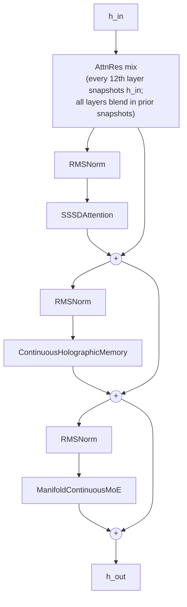
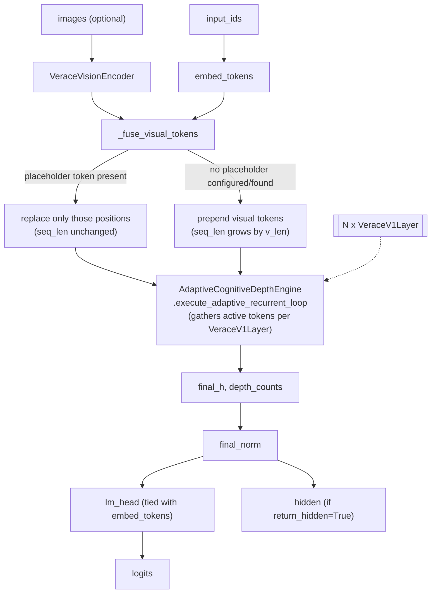

# Backbone

**Module:** `verace_v1/modules/backbone.py`
**Classes:** `VeraceV1Layer`, `VeraceV1Model`
**Assembles:** SSSD attention, CHAM memory, M-CMoE, ACD engine, energy critic, vision encoder

## `VeraceV1Layer`

One decoder layer, applying three residual sub-layers in sequence, each with
its own pre-norm:

```
h = h + SSSDAttention(RMSNorm(h))
h = h + ContinuousHolographicMemory(RMSNorm(h))
h = h + ManifoldContinuousMoE(RMSNorm(h))
```

It also participates in a cross-layer residual mechanism ("AttnRes"): every
12th layer (`layer_idx % 12 == 0`) snapshots its input into a
`block_residual` buffer; every layer mixes its input with an attention-
weighted combination of prior snapshots before running its sub-layers. This
gives later layers direct (softmax-weighted) access to earlier-layer
representations beyond what the residual stream alone provides.

```python
VeraceV1Layer(layer_idx: int, config: VeraceV1Config)

forward(
    h_in: Tensor,                                                # [batch, seq_len, hidden_dim]
    block_residual: Optional[Tensor] = None,                     # [total_tokens, num_blocks, hidden_dim]
    sssd_state: Optional[Tensor] = None,
    cham_hologram: Optional[Tuple[Tensor, Tensor]] = None,
    active_mask: Optional[Tensor] = None,                        # [batch, seq_len]
) -> (h_out: Tensor, block_residual: Tensor, new_sssd_state: Optional[Tensor])
```

## `VeraceV1Model`

Assembles the full model:

- `embed_tokens` / `lm_head`: tied token embedding and output projection.
- `vision_encoder`: a `VeraceVisionEncoder` (see
  [vision-encoder.md](vision-encoder.md)); if `images` is passed to
  `forward`, its output tokens are fused into `token_embeds` via
  `_fuse_visual_tokens` (see below) — never by overwriting text.
- `layers`: `config.num_layers` instances of `VeraceV1Layer`.
- `acd_engine`: an `AdaptiveCognitiveDepthEngine` (see
  [acd-engine.md](acd-engine.md)) that drives per-token early exit across
  `layers` when `use_adaptive_depth=True`.
- `energy_critic`: a `LatentEnergyCritic` (see
  [energy-critic.md](energy-critic.md)), constructed here but called from
  the generation and training code, not from within `forward` itself — see
  [../serving/generation.md](../serving/generation.md) and
  [../training/pretraining.md](../training/pretraining.md).
- `final_norm`: RMSNorm applied before the LM head.

```python
VeraceV1Model(config: VeraceV1Config)

forward(
    input_ids: Tensor,                    # [batch, seq_len]
    images: Optional[Tensor] = None,
    use_adaptive_depth: bool = True,
    return_hidden: bool = False,
)
# returns (logits, depth_counts) — logits: [batch, seq_len, vocab_size], depth_counts: [batch, seq_len]
# if return_hidden=True, also returns hidden: [batch, seq_len, hidden_dim] (post-final_norm,
# pre-lm_head) — the representation LatentEnergyCritic scores in generation and training.
#
# NOTE: when images is not None, seq_len in the output can be larger than
# input_ids.shape[1] -- see _fuse_visual_tokens below. Callers that align
# labels against logits (e.g. train_pretrain_step) must account for this;
# see docs/training/pretraining.md.
```

When `use_adaptive_depth=False`, every layer runs for every token
(`depth_counts` is filled with `len(self.layers)`) — this is the fallback
path used to sanity-check ACDE's output against the fixed-depth baseline.

See [overview.md](overview.md) for how this fits into the full forward and
generation flow.

## `_fuse_visual_tokens`

```python
_fuse_visual_tokens(
    token_embeds: Tensor,   # [batch, seq_len, hidden_dim]
    input_ids: Tensor,      # [batch, seq_len]
    visual_tokens: Tensor,  # [batch, v_len, hidden_dim]
) -> Tensor
```

Fuses vision-encoder output into the text embedding sequence **without ever
discarding text**. Two modes, chosen automatically:

- **`config.media_placeholder_token_id` is set and appears in `input_ids`:**
  visual tokens replace embeddings only at those exact positions, per batch
  item (a mismatched placeholder count in one item doesn't affect another).
  Sequence length is unchanged.
- **Otherwise (the default):** visual tokens are prepended. Sequence length
  grows by `v_len`.

An earlier version of this function unconditionally overwrote
`token_embeds[:, :v_len]` with visual tokens regardless of what text
occupied those positions — silently destroying the first `v_len` tokens of
any prompt whenever an image was passed. See `tests/test_vision_fusion.py`
for the regression tests covering both fusion modes and the resulting
`logits`/`labels` alignment in [pretraining](../training/pretraining.md).

## Diagram

`VeraceV1Layer` — one decoder layer:



`VeraceV1Model` — full forward pass:


