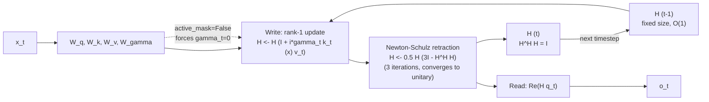

# CHAM Memory

**Module:** `verace_v1/modules/cham_memory.py`
**Classes:** `ContinuousHolographicMemory`, `newton_schulz_unitary_retraction`
**Replaces:** the KV cache
**Test:** `tests/test_cham.py`

## Problem

A KV cache stores one key/value pair per past token, so its memory footprint
and the cost of attending over it both grow linearly (or worse) with
sequence length. CHAM instead maintains a single fixed-size complex matrix
that is updated — not appended to — at every step.

## Mechanism

CHAM holds a complex holographic matrix `H = H_r + i·H_i` of shape
`(holographic_dim, holographic_dim)`, kept unitary (`H^H H = I`, i.e.
`H` is in `U(d)`) after every update:

1. **Write:** an infinitesimal unitary transformation folds in the current
   token's key/value outer product, gated by `gamma_t`:

   ```
   H_next = H * (I + i * gamma_t * (k_t ⊗ v_t))
   ```

2. **Retract:** the result is not exactly unitary after a finite step, so it
   is projected back onto `U(d)` by Newton-Schulz iteration:

   ```
   H <- 0.5 * H * (3*I - H^H H)     # repeated `steps` times (default 3)
   ```

   This converges quadratically to the nearest unitary matrix, so a small
   number of iterations is enough to hold `H^H H = I` to high precision at
   every step.

3. **Read:** the query is projected through the current hologram,
   `Re(H · q_t)`, and normed/projected back to `hidden_dim`.

`gamma_t` (from `w_gamma`, scaled to `[0, 0.1]`) controls how strongly each
token's key/value pair perturbs the hologram — a token with `gamma_t = 0`
leaves `H` unchanged.

## Why O(1)

`H` has a fixed shape regardless of how many tokens have been processed.
Each step is a constant amount of work (a handful of `holographic_dim ×
holographic_dim` matmuls), so both the memory footprint and the per-token
compute cost are independent of sequence length — unlike a KV cache, whose
read cost grows with the number of cached tokens.

## Halted Tokens

When `active_mask` is provided, `gamma` is zeroed for inactive positions —
same "zero-gate → identity update" pattern used in
[sssd-attention.md](sssd-attention.md): a halted token's hologram
contribution stops exactly, not approximately.

## Constructor

```python
ContinuousHolographicMemory(
    hidden_dim: int = 16384,
    holographic_dim: int = 1024,
)
```

## `forward`

```python
forward(
    x: Tensor,                                             # [batch, seq_len, hidden_dim]
    initial_hologram: Optional[Tuple[Tensor, Tensor]] = None,  # (H_real, H_imag)
    active_mask: Optional[Tensor] = None,                  # [batch, seq_len]
) -> (output: Tensor, hologram: Tuple[Tensor, Tensor])
```

If `x.is_cuda` and Triton is available, dispatches to
`launch_cham_triton_update`; otherwise runs the explicit per-step
write/retract/read loop in PyTorch shown above.

## What the Test Checks

`tests/test_cham.py` runs a forward pass and asserts `||H^H H - I||` (the
deviation from exact unitarity) stays below `1e-3`.

## Diagram



