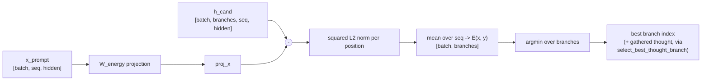

# Energy Critic

**Module:** `verace_v1/modules/energy_critic.py`
**Class:** `LatentEnergyCritic`
**Used by:** [generation branch selection](../serving/generation.md) and the
[pretraining energy loss](../training/pretraining.md)
**Test:** exercised indirectly via `tests/test_end2end.py`

## Problem

Sampling a single continuation token-by-token commits early to choices that
may turn out to be locally plausible but globally inconsistent. Scoring
multiple candidate continuations and picking the best one needs a notion of
"best" that doesn't require running the full downstream model again.

## Mechanism

`LatentEnergyCritic` scores a candidate latent representation against the
prompt with a quadratic energy function:

```
E(x, y) = || h_cand - W_energy * x ||_2^2
```

- `x`: prompt representation, `[batch, seq_len, hidden_dim]`
- `h_cand`: one or more candidate latent continuations,
  `[batch, num_branches, seq_len, hidden_dim]`
- `W_energy`: a learned linear projection (`w_energy`)

Lower energy means the candidate is closer to what `W_energy` predicts from
the prompt — i.e. higher consistency. `select_best_thought_branch` computes
the energy for every branch and returns the argmin branch per batch item.

## API

```python
compute_energy(x_prompt: Tensor, h_cand: Tensor) -> Tensor
# x_prompt: [batch, seq_len, hidden_dim]
# h_cand:   [batch, num_branches, seq_len, hidden_dim]
# returns:  [batch, num_branches]

select_best_thought_branch(x_prompt: Tensor, candidate_thoughts: Tensor) -> (Tensor, Tensor)
# returns: (best_thought [batch, seq_len, hidden_dim], best_branch_idx [batch])
```

## Constructor

```python
LatentEnergyCritic(hidden_dim: int = 16384)
```

## Integration Status

`LatentEnergyCritic` is instantiated in `VeraceV1Model.__init__`
(`self.energy_critic`) and used in two places:

- **Generation** (`VeraceV1Generator._select_branch_by_energy`, see
  [../serving/generation.md](../serving/generation.md)): calls
  `compute_energy` directly (not the `select_best_thought_branch`
  convenience wrapper — the generator already has the candidate token ids
  from sampling, so it only needs the argmin index, not a gathered thought
  tensor) to pick the minimum-energy candidate token at each step.
- **Pretraining** (`train_pretrain_step`, see
  [../training/pretraining.md](../training/pretraining.md)): calls
  `compute_energy(hidden[:, :-1, :], hidden[:, 1:, :].unsqueeze(1))` to add
  a consecutive-hidden-state consistency term to the training loss, under
  the same `W_energy` projection used at generation time.

`select_best_thought_branch` itself (which also gathers the winning thought
tensor, not just its index) shares `compute_energy`'s implementation but has
no caller and no dedicated test — it's there for cases where you already
have full candidate thought tensors precomputed (e.g. an external
beam-search harness) rather than needing to run the model forward per
candidate, which is what the generator's own branch selection does.

## Diagram


