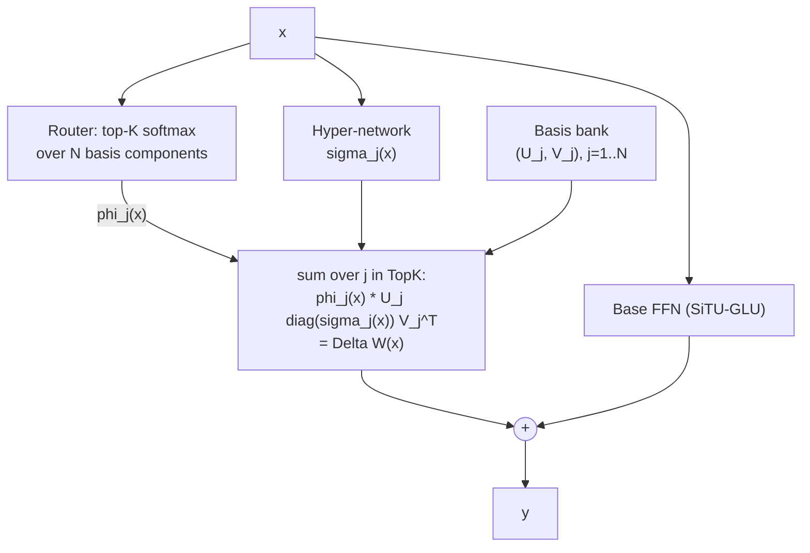

# M-CMoE (Manifold Continuous Mixture-of-Experts)

**Module:** `verace_v1/modules/mcmoe.py`
**Class:** `ManifoldContinuousMoE`
**Replaces:** discrete routed mixture-of-experts
**Test:** `tests/test_mcmoe.py`

## Problem

Standard sparse MoE routes each token to a small number of discrete expert
weight matrices. At scale, those experts typically live on different
devices, so routing requires an all-to-all communication step to ship tokens
to the device holding their assigned expert and ship the results back — a
significant distributed-training bottleneck.

## Mechanism

M-CMoE replaces discrete expert weight matrices with a shared bank of `N`
low-rank basis generators `(U_j, V_j)`, and assembles a token's expert
contribution **locally**, without dispatching the token anywhere:

```
Delta W(x) = sum_{j in TopK(x)} phi_j(x) * ( U_j * diag(sigma_j(x)) * V_j^T )
```

- `phi_j(x)`: top-K router weights (softmax over `router`, top-`k` kept)
- `sigma_j(x)`: per-token singular-value scaling for component `j`,
  produced by a small hypernetwork (`hyper_sigma`) conditioned on `x` — this
  is what makes the adaptation *continuous* rather than a fixed per-expert
  matrix
- `U_j`, `V_j`: shared low-rank basis matrices (`u_basis`, `v_basis`),
  `rank`-dimensional

Because `Delta W(x)` is computed as a small number of local matmuls against
shared parameters already resident on the device, there is no cross-device
token dispatch — the "all-to-all" step that a discrete MoE requires simply
does not exist in this formulation.

A shared base feed-forward path (`base_situ_glu` → `base_w_down`, using the
[SiTU-GLU activation](../modules/overview.md)) runs for every token
regardless of routing; `Delta W(x)` is added on top of it.

## Constructor

```python
ManifoldContinuousMoE(
    hidden_dim: int = 16384,
    rank: int = 32,
    num_components: int = 64,
    top_k_components: int = 8,
    beta1: float = 4.0,   # SiTU-GLU shape parameter for the base FFN
    beta2: float = 25.0,  # SiTU-GLU shape parameter for the base FFN
)
```

`rank` and `num_components` come from `VeraceV1Config.mcmoe_rank` /
`mcmoe_num_components` when built via `VeraceV1Layer`; `top_k_components`,
`beta1`, and `beta2` are currently hardcoded at the `VeraceV1Layer` call site
rather than read from config — see [configuration.md](../configuration.md).

## `forward`

```python
forward(x: Tensor) -> Tensor   # [batch, seq_len, hidden_dim] -> same shape
```

If `x.is_cuda` and Triton is available, dispatches to
`launch_mcmoe_triton_projection`; otherwise loops over the top-K selected
components in PyTorch, gathering each token's selected basis matrices via
`torch.gather`.

## What the Test Checks

`tests/test_mcmoe.py` checks output shape and that no `NaN` values appear —
a numerical-stability smoke test rather than an algebraic invariant, since
M-CMoE (unlike SSSD, CHAM, and Unitary Muon) does not maintain a manifold
constraint at inference time.

## Diagram



