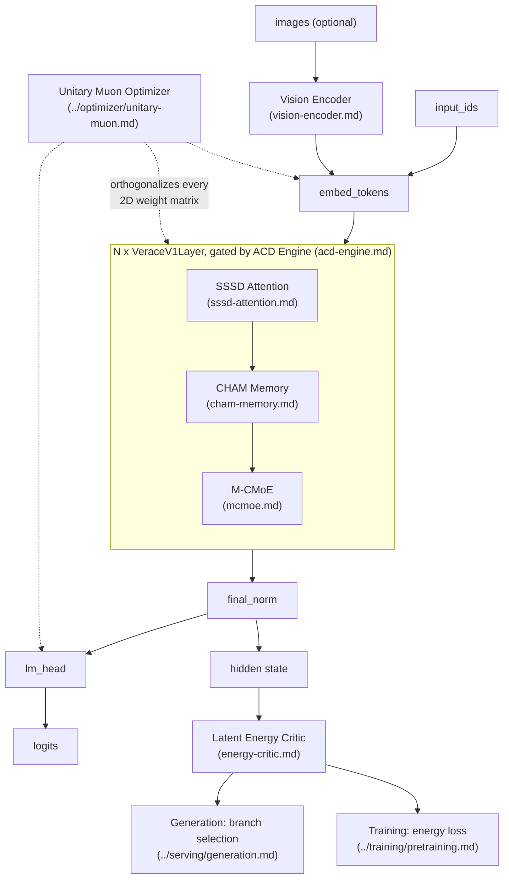

# Architecture Overview

Verace V1 replaces four standard transformer subsystems with continuous,
manifold-based alternatives, and adds a fifth component for dynamic per-token
compute allocation. It was designed top-down: start from a target property
(e.g. "memory cost must not grow with context length"), then construct the
mechanism that provably satisfies it, rather than incrementally patching an
existing transformer.

| Subsystem | Standard Transformer | Verace V1 | Doc |
| :--- | :--- | :--- | :--- |
| Sequence mixing | Softmax self-attention | Spectral State-Space Differential Attention (SSSD) | [sssd-attention.md](sssd-attention.md) |
| Long-range memory | KV cache (grows with sequence length) | Continuous Holographic Associative Memory (CHAM), O(1) in sequence length | [cham-memory.md](cham-memory.md) |
| Expert computation | Discrete routed MoE with all-to-all dispatch | Manifold Continuous MoE (M-CMoE), locally generated expert weights | [mcmoe.md](mcmoe.md) |
| Compute allocation | Fixed depth for every token | Adaptive Cognitive Depth Engine (ACDE), per-token early exit | [acd-engine.md](acd-engine.md) |
| Decoding | Greedy / beam / sampling | Latent Energy Critic scoring parallel latent branches | [energy-critic.md](energy-critic.md) |
| Vision input | Various | Patch-based vision encoder with 2×2 token merging | [vision-encoder.md](vision-encoder.md) |
| Optimization | AdamW / plain Muon | Unitary Muon (Stiefel-manifold-orthogonalized momentum) | [../optimizer/unitary-muon.md](../optimizer/unitary-muon.md) |

## System Diagram

## How a Forward Pass Flows

`VeraceV1Model.forward` (`backbone.py`, documented in [backbone.md](backbone.md)):

1. Token IDs are embedded (`embed_tokens`); if images are provided, visual
   tokens from `VeraceVisionEncoder` are spliced into the leading positions
   of the embedding sequence.
2. The embeddings are run through `VeraceV1Layer` instances. Each layer
   applies, in order: SSSD attention → CHAM associative memory → M-CMoE —
   each as a residual sub-layer with its own pre-norm.
3. Layer iteration is controlled by `AdaptiveCognitiveDepthEngine`, which
   gathers only the still-active tokens for each layer call and halts tokens
   independently once their accumulated halting probability crosses
   `energy_halting_threshold`.
4. The final hidden state is normed and projected to logits by a tied
   embedding/LM-head matrix.
5. The model returns `(logits, depth_counts)` — `depth_counts` records how
   many layers each token actually ran through, which is what the ACDE
   FLOP-reduction property (documented in [acd-engine.md](acd-engine.md))
   is measured against.

## How Generation Flows

`VeraceV1Generator.generate` (`serving/hyper_generate.py`, documented in
[../serving/generation.md](../serving/generation.md)) runs the model
autoregressively. By default it samples several candidate next tokens per
step and picks the one with lowest `LatentEnergyCritic` energy against the
context (documented in [energy-critic.md](energy-critic.md)) rather than
committing to a single sample — this is the "tree search" the module name
refers to, at the cost of extra forward passes per token (see
[../serving/generation.md](../serving/generation.md#cost)).

## Design Principle Common to SSSD, CHAM, and Unitary Muon

Three components share the same underlying idea: keep a matrix (a state,
a memory hologram, or a momentum buffer) *exactly* on an orthogonal/unitary
manifold at every step, rather than approximately or only at initialization.
Each does this with a different, appropriately-shaped technique — a Cayley
transform for SSSD's per-step rotation, Newton-Schulz retraction for CHAM's
running hologram, and SVD-based polar decomposition for Unitary Muon's
per-parameter update. This is what backs the "exact" claims in each
component's test (norm conservation, unitary constraint, orthogonality) —
they are not approximate regularizers, they are algebraic guarantees checked
directly by `tests/`.
