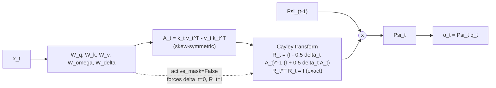

# SSSD Attention

**Module:** `verace_v1/modules/sssd_attention.py`
**Class:** `SSSDAttention`
**Replaces:** softmax self-attention
**Test:** `tests/test_sssd.py`

## Problem

Standard self-attention recomputes an `O(seq_len^2)` score matrix and needs
the full key/value history to attend over. Linear-attention and SSM variants
avoid the quadratic cost with a recurrent state, but many such recurrences
let the state norm drift (grow or vanish) over long sequences, which
degrades numerical stability.

## Mechanism

SSSD keeps a per-head state matrix `Psi` and updates it at every step with an
**exactly orthogonal** rotation, so its Frobenius norm is invariant by
construction — not by regularization.

```
A_t   = k_t v_t^T - v_t k_t^T                          # skew-symmetric: A^T = -A
R_t   = (I - 0.5 * delta_t * A_t)^-1 (I + 0.5 * delta_t * A_t)   # Cayley transform: R_t^T R_t = I
Psi_t = R_t * Psi_{t-1}
o_t   = Psi_t * q_t
```

Because `A_t` is skew-symmetric, the Cayley transform `R_t` is guaranteed to
be orthogonal (this is a standard result: the Cayley transform maps the Lie
algebra `so(d)` of skew-symmetric matrices onto `SO(d)`, the group of
rotation matrices). Multiplying `Psi` by an orthogonal matrix at every step
cannot change its Frobenius norm, so:

```
||Psi_t||_F = ||Psi_0||_F   for all t
```

`delta_t` (from `w_delta`, scaled to `[0, 0.1]` via sigmoid) controls how much
each step's key/value pair rotates the state; `omega` (from `w_omega`) is
generated but the Cayley-transform path (the default, CPU/GPU-agnostic
PyTorch path) derives rotation directly from `A_t` rather than from `omega`.
The Triton kernel path (see
[../serving/triton-kernels.md](../serving/triton-kernels.md)) uses a
mathematically equivalent complex-phase formulation driven by `omega`.

## Halted Tokens

When `active_mask` is provided (from the ACD engine — see
[acd-engine.md](acd-engine.md)), `delta` is zeroed for inactive positions,
which makes `R_t = I` for those tokens: the recurrence becomes an identity
update, so a halted token's state stops changing exactly, rather than being
masked after the fact.

## Constructor

```python
SSSDAttention(
    hidden_dim: int = 16384,
    num_heads: int = 128,
    head_dim: int = 128,
    spectral_dim: int = 256,   # accepted, not currently consumed — see docs/configuration.md
)
```

## `forward`

```python
forward(
    x: Tensor,                              # [batch, seq_len, hidden_dim]
    initial_state: Optional[Tensor] = None, # [batch, num_heads, head_dim, head_dim]
    return_state: bool = False,
    active_mask: Optional[Tensor] = None,   # [batch, seq_len]
) -> (output: Tensor, state: Optional[Tensor])
```

If `x.is_cuda` and Triton is available, dispatches to the fused GPU kernel
(`launch_sssd_triton_scan`); otherwise runs the explicit per-step Cayley
transform loop in PyTorch shown above. Both paths are mathematically
equivalent.

## What the Test Checks

`tests/test_sssd.py` runs a forward pass with `return_state=True` and asserts
`||Psi_final||_F` matches `||Psi_initial||_F = sqrt(head_dim)` (the Frobenius
norm of the identity-initialized state) within `1e-4`.

## Diagram

Per-timestep recurrence (repeated for `t = 1..seq_len`, one state `Psi` per head):



