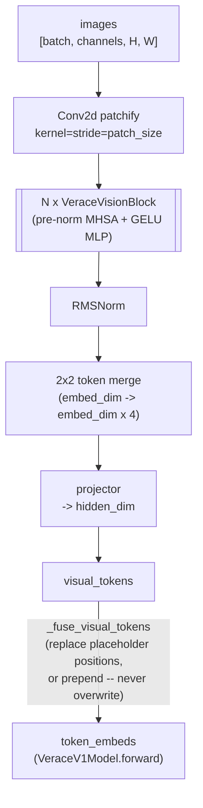

# Vision Encoder

**Module:** `verace_v1/modules/vision.py`
**Classes:** `VeraceVisionBlock`, `VeraceVisionEncoder`
**Used by:** `VeraceV1Model` (see [backbone.md](backbone.md))

## Mechanism

A standard patch-based ViT encoder:

1. **Patchify:** a `Conv2d` with `kernel_size = stride = patch_size` splits
   the image into non-overlapping patches and embeds each to `embed_dim`.
2. **Transformer blocks:** `num_layers` instances of `VeraceVisionBlock`
   (pre-norm multi-head self-attention + GELU MLP, both with RMSNorm) refine
   the patch embeddings.
3. **2×2 token merging:** adjacent 2×2 patch groups are concatenated
   (`embed_dim * 4`) before a final projector maps them to the language
   model's `hidden_dim` (`projector_dim`). This reduces the number of visual
   tokens by 4x before they enter the decoder's token sequence, and pads the
   patch grid with zeros first if its height or width is odd.
4. The projected visual tokens are fused into the token embedding sequence
   by `VeraceV1Model._fuse_visual_tokens` (see
   [backbone.md#_fuse_visual_tokens](backbone.md#_fuse_visual_tokens)) — never
   by overwriting text — so images and text share the same downstream
   decoder stack; there is no separate vision pathway past this point.

## Constructors

```python
VeraceVisionBlock(embed_dim: int = 1152, num_heads: int = 12)

VeraceVisionEncoder(
    embed_dim: int = 1152,
    num_layers: int = 27,
    num_heads: int = 12,
    patch_size: int = 14,
    in_channels: int = 3,
    projector_dim: int = 16384,   # should match VeraceV1Config.hidden_dim
)
```

`VeraceV1Model` builds `VeraceVisionEncoder` from
`VeraceV1Config.vision_config` (defaulted in `VeraceV1Config.__post_init__`
if not provided — see [../configuration.md](../configuration.md)) with
`projector_dim=config.hidden_dim`.

## `forward`

```python
forward(images: Tensor) -> Tensor   # [batch, channels, H, W] -> [batch, num_merged_patches, hidden_dim]
```

## Diagram


