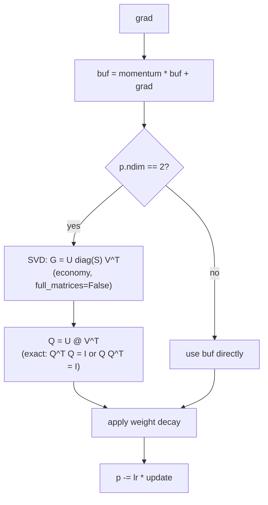

# Unitary Muon Optimizer

**Module:** `verace_v1/optimizer/unitary_muon.py`
**Classes:** `UnitaryMuon`, `stiefel_orthogonalize`
**Test:** `tests/test_unitary_muon.py`, also exercised in `tests/test_end2end.py`

## What It Is

`UnitaryMuon` is a Muon-family optimizer (momentum, then an orthogonalizing
transform applied to the momentum buffer before the parameter update) for
every 2D parameter, projecting each matrix onto the Stiefel manifold.

## Mechanism

For each parameter `p`:

1. Update a momentum buffer: `buf = momentum * buf + grad`.
2. If `p` is 2D, orthogonalize `buf` via `stiefel_orthogonalize` before
   using it as the update; otherwise use `buf` directly.
3. Apply decoupled weight decay, then the (possibly orthogonalized) update:
   `p -= lr * update`.

`stiefel_orthogonalize(G)` projects a 2D matrix `G` (shape `M x N`, square,
tall, or wide) onto the Stiefel manifold via **exact SVD-based polar
decomposition**:

```
G = U diag(S) V^T     (economy SVD)
Q = U V^T
```

This guarantees `Q^T Q = I` (when `M >= N`) or `Q Q^T = I` (when `M <= N`)
to floating-point precision, in a single non-iterative pass — regardless of
`G`'s singular value spectrum.

### Why not Newton-Schulz iteration?

An earlier version of this function used iterative Newton-Schulz
orthogonalization (the same family of technique CHAM uses for its hologram
retraction — see [../modules/cham-memory.md](../modules/cham-memory.md)) —
a Cayley transform for square matrices, and a Newton-Schulz polynomial
iteration for rectangular ones. That was replaced after measurement showed
it doesn't converge for rectangular matrices with small singular values
(the common case for real gradient/momentum matrices): traced through the
iteration, a small starting value doesn't approach 1, it locks into a
**permanent two-step oscillation** (e.g. `0.68 → 1.13 → 0.68 → 1.13 → ...`,
forever) — more iterations do not fix this, they just keep oscillating.
This affected every non-square parameter, which is most `nn.Linear` layers
in this architecture.

SVD-based polar decomposition has no iteration and therefore no convergence
condition to fail — it's the standard, exact solution to the same
projection problem (the orthogonal Procrustes problem), just paid for with
an SVD instead of a few matrix multiplies. See `tests/test_unitary_muon.py`
for the regression test covering square, tall, wide, and
pathologically-small-singular-value cases.

## Constructor

```python
UnitaryMuon(
    params,
    lr: float = 0.03,
    momentum: float = 0.98,
    weight_decay: float = 0.05,
)
```

These defaults mirror `VeraceV1Config.learning_rate` /
`unitary_muon_momentum` / `weight_decay`, but are **not** read from the
config automatically — construct the optimizer with explicit values, as in
`tests/test_end2end.py`:

```python
optimizer = UnitaryMuon(model.parameters(), lr=0.01)
```

See [../configuration.md](../configuration.md) for the full note on which
config fields are and aren't auto-wired.

## `step`

Standard PyTorch `Optimizer.step(closure=None)` — safe to use anywhere a
`torch.optim.Optimizer` is expected.

## Diagram


