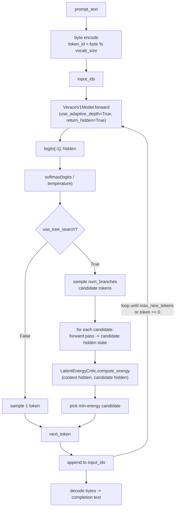

# Generation

**Module:** `verace_v1/serving/hyper_generate.py`
**Class:** `VeraceV1Generator`
**Test:** exercised in `tests/test_end2end.py`

## What It Does

Autoregressive decoding with two selectable strategies per step:

1. The prompt is encoded as raw bytes, `token_id = byte_value % vocab_size`
   — a placeholder tokenizer for exercising the model end-to-end, not a
   production tokenization scheme. Swap in a real tokenizer before using
   this for anything beyond testing.
2. At each step, `VeraceV1Model.forward(..., use_adaptive_depth=True,
   return_hidden=True)` is called on the full sequence so far, so every
   generated token benefits from the [ACD engine's](../modules/acd-engine.md)
   per-token compute allocation, and the post-final-norm hidden state is
   available for branch scoring.
3. **Token selection:**
   - `use_tree_search=True` (default): `_select_branch_by_energy` samples
     `num_branches` candidate next tokens from
     `softmax(logits[-1] / temperature)` without replacement, runs the model
     forward on each resulting sequence to get that candidate's latent
     state, scores each against the context with
     [`LatentEnergyCritic.compute_energy`](../modules/energy-critic.md), and
     commits the minimum-energy candidate.
   - `use_tree_search=False`: samples a single token directly from
     `softmax(logits[-1] / temperature)` — one forward pass per token, no
     energy scoring.
4. Generation stops at `max_new_tokens` or when token id `0` is produced.
5. Generated token ids are decoded back to bytes
   (`byte = token_id % 256`) and decoded as UTF-8, ignoring errors.

```python
VeraceV1Generator(model: VeraceV1Model, config: VeraceV1Config)

generate(
    prompt_text: str,
    max_new_tokens: int = 512,
    temperature: float = 0.7,
    use_tree_search: bool = True,
    num_branches: Optional[int] = None,   # defaults to config.tree_branches
) -> str
```

## Cost

Tree search is not free: each generated token costs `num_branches + 1` full
forward passes through `VeraceV1Model` (one for the base logits/hidden state,
one per candidate) instead of one, because the model has no incremental/KV-
cache state to reuse between the base call and each candidate call — every
call recomputes the full sequence from scratch. With the default
`tree_branches=4`, that's 5x the forward-pass cost of `use_tree_search=False`.
Pass `use_tree_search=False`, or a smaller `num_branches`, when latency
matters more than branch scoring.

## What's Not Wired In Yet

**`HyperXTMLFormatter`** (`self.formatter`) is constructed but `generate()`
returns raw decoded text, not `HyperXTMLFormatter`-formatted output — see
[../chat_template/hyper-xtml.md](../chat_template/hyper-xtml.md). Wiring
generated text through the formatter (constructing a `HyperThought` per
step from its cognitive depth and energy score) is a natural next step, not
yet implemented.

## Diagram


