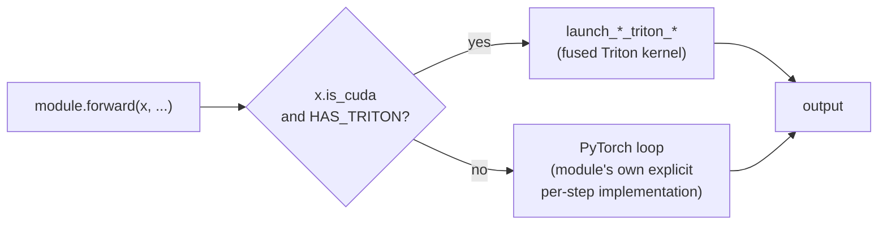

# Triton GPU Kernels

**Module:** `verace_v1/serving/triton_kernels.py`

Fused Triton GPU kernels for the three modules that have both a PyTorch
fallback path and a GPU-fused path. These kernels require a CUDA device;
there is no CPU fallback inside this module (the CPU/GPU-agnostic PyTorch
implementations live in the modules themselves — see below).

Dispatch is automatic: each module checks `x.is_cuda and HAS_TRITON` and
calls the corresponding launcher; otherwise it runs its own PyTorch loop. No
caller-side code changes are needed to use the GPU path.

## `HAS_TRITON`

`True` if `triton` is importable, `False` otherwise (degrades gracefully via
`try/except ImportError`). Every module that imports Triton kernels does so
through this flag, so the package works without Triton installed — you just
don't get the fused GPU path.

## `triton_kernels.py`

| Symbol | Used by | Purpose |
| :--- | :--- | :--- |
| `sssd_cayley_scan_kernel` / `launch_sssd_triton_scan` | [SSSD Attention](../modules/sssd-attention.md) | Per-step Cayley-transform unitary state scan across the batch/head grid |
| `cham_holographic_scan_kernel` / `launch_cham_triton_update` | [CHAM Memory](../modules/cham-memory.md) | Fused holographic write + retract + read per token |
| `mcmoe_manifold_gpu_kernel` / `launch_mcmoe_triton_projection` | [M-CMoE](../modules/mcmoe.md) | Fused top-K manifold projection per token |

Each `launch_*` function asserts its input tensors are on CUDA
(`"This kernel requires CUDA tensors"`) before dispatching to the
corresponding `@triton.jit` kernel.

## Note

Unlike the optimizer, these kernels implement the *same* mathematics as
their PyTorch counterparts, just fused for throughput — they are not a
separate algorithm. If you're auditing correctness, the PyTorch paths in
`verace_v1/modules/*.py` are the easier ones to read; the Triton kernels here
are the GPU-optimized equivalents.

## Diagram

Dispatch, per call, for each of SSSD / CHAM / M-CMoE:

