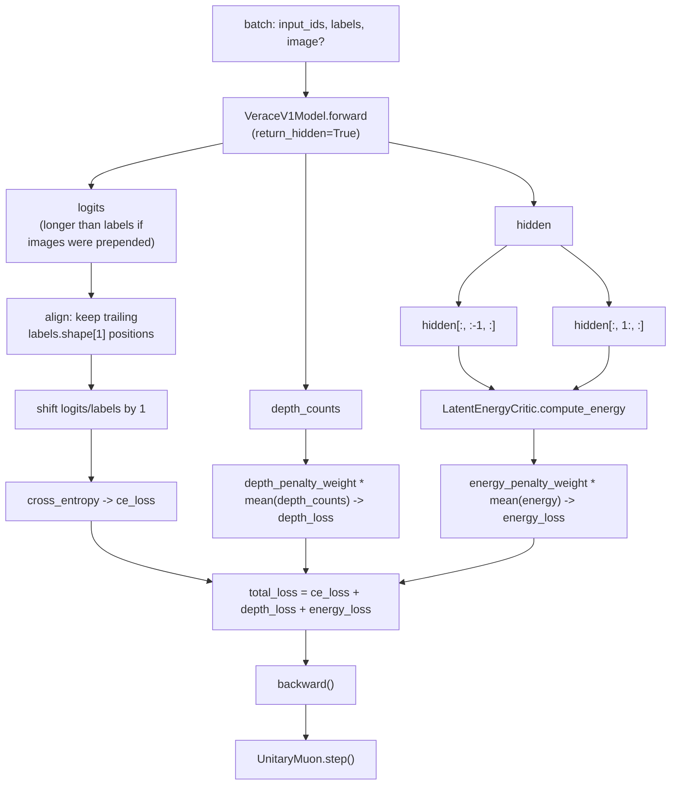

# Pretraining

**Module:** `verace_v1/training/pretrain.py`
**Function:** `train_pretrain_step`
**Test:** exercised in `tests/test_end2end.py`; the image-conditioned path is
covered by `tests/test_vision_fusion.py`

## What It Does

A single training step minimizing three terms:

```
loss = ce_loss + depth_penalty_weight * mean(depth_counts)
               + energy_penalty_weight * mean(E(h_{t-1}, h_t))
```

- **Cross-entropy term (`ce_loss`):** standard next-token prediction loss,
  shifting logits/labels by one position.
- **Depth penalty term:** the mean number of layers tokens actually ran
  through (`depth_counts`, from the [ACD engine](../modules/acd-engine.md)),
  scaled by `depth_penalty_weight` (default `0.001`). This gives the model
  gradient pressure toward using fewer layers when accuracy doesn't require
  more — the training-time counterpart to ACDE's inference-time FLOP
  reduction.
- **Energy consistency term:** `E(h_{t-1}, h_t)` from
  [`LatentEnergyCritic.compute_energy`](../modules/energy-critic.md),
  applied between each position's post-final-norm hidden state and the
  next, scaled by `energy_penalty_weight` (default `0.01`). This trains the
  same `W_energy` projection that scores generation-time branches (see
  [../serving/generation.md](../serving/generation.md)) to be predictive of
  the model's own consecutive hidden states, so branch scoring at inference
  time reflects something the model was actually optimized for — rather
  than an untrained, randomly-initialized critic.

```python
train_pretrain_step(
    model: VeraceV1Model,
    optimizer: UnitaryMuon,
    batch: dict,                       # {"input_ids": Tensor, "labels": Tensor, "image": Optional[Tensor]}
    depth_penalty_weight: float = 0.001,
    energy_penalty_weight: float = 0.01,
) -> (ce_loss: float, mean_depth: float)
```

### Images and label alignment

When `batch["image"]` is provided and no `media_placeholder_token_id` is
configured (or the placeholder isn't present in that batch — see
[Backbone](../modules/backbone.md#_fuse_visual_tokens)), the model prepends
visual tokens, so `logits.shape[1]` comes back larger than
`labels.shape[1]`. `train_pretrain_step` guards against this explicitly:

```python
if logits.shape[1] != labels.shape[1]:
    logits = logits[:, -labels.shape[1]:, :]
```

This keeps only the trailing (text) positions before the
`shift_logits`/`shift_labels` next-token alignment. Without this guard, the
shift would silently misalign against the prepended visual positions —
wrong gradients with no error or shape exception. See
`tests/test_vision_fusion.py::test_pretrain_step_aligns_logits_when_images_grow_sequence_length`.

## What This Is Not

This function is a minimal, correct reference for wiring the model, loss,
and [Unitary Muon optimizer](../optimizer/unitary-muon.md) together — one
`forward` → `backward` → `step` call. It does not include:

- Data loading or a dataset abstraction (`batch` is assumed already
  collated and on the right device).
- Distributed training (no DDP/FSDP wiring).
- Checkpointing or learning-rate scheduling.
- Gradient accumulation or clipping.

See [../getting-started.md](../getting-started.md) for the full scope of
what is and isn't included in this repository.

## Example

```python
from verace_v1 import VeraceV1Config, VeraceV1Model, UnitaryMuon
from verace_v1.training.pretrain import train_pretrain_step
import torch

config = VeraceV1Config(vocab_size=1000, hidden_dim=128, num_layers=4, num_heads=2, head_dim=64)
model = VeraceV1Model(config)
optimizer = UnitaryMuon(model.parameters(), lr=0.01)

input_ids = torch.randint(0, config.vocab_size, (2, 16))
batch = {"input_ids": input_ids, "labels": input_ids.clone()}

ce_loss, mean_depth = train_pretrain_step(model, optimizer, batch)
```

## Diagram


